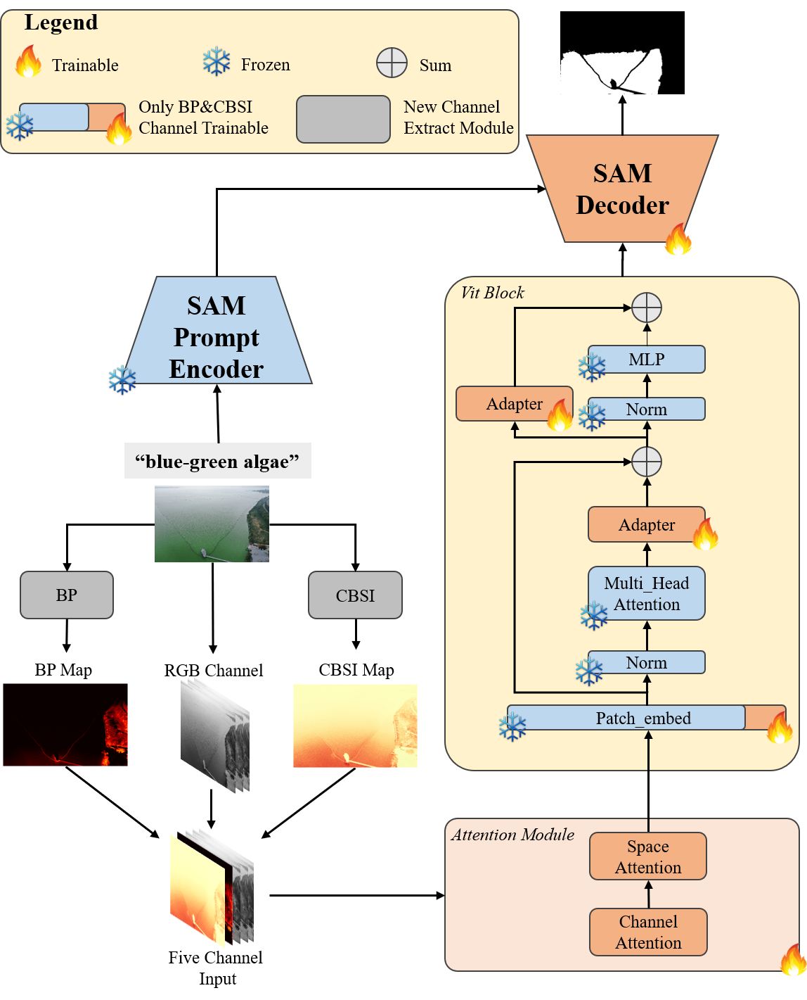

# HAB-SAM

**A Physics-Informed Adaptation of Segment Anything Model for Harmful Algal Blooms Segmentation from UAV Imagery**

HAB-SAM is a physics-informed model for semantic segmentation of harmful algal blooms (HABs) in UAV RGB imagery. Built on SAM3, it incorporates optical priors computed directly from RGB images and uses parameter-efficient fine-tuning to adapt pretrained visual representations to complex water-surface scenes.

This repository contains the HAB-SAM model implementation, training configurations, data-processing utilities, evaluation code, and attention-visualization tools.

## Model Overview

HAB-SAM augments SAM3 with the RGB-derived Cyanobacterial Bloom Sensitive Index (CBSI) and Brightness Penalty (BP), producing a five-channel `RGB + CBSI + BP` input. Domain adaptation is implemented through an expanded patch embedding, channel-spatial attention, and lightweight adapters. During training, the SAM3 backbone is frozen while the newly introduced modules and mask decoder are updated.



The flame symbol denotes a trainable module, while the snowflake denotes a frozen module. See the accompanying paper for the complete method and experimental design.

## Repository Structure

```text
sam3-main/
├── sam3/
│   ├── model/                         # SAM3 and HAB-SAM model components
│   ├── model_builder.py               # Model construction entry point
│   └── train/
│       ├── configs/                   # Training configurations
│       ├── loss/                      # Joint loss functions
│       └── trainer.py                 # Training pipeline
├── scripts/
│   ├── fine_tune_lake_sh_freeze_encoder.sh
│   ├── fine_tune_lake_sh.sh
│   ├── evaluate_lake_sh_detailed.py
│   ├── compute_stats.py
│   └── visualize_channel_spatial_attention.py
├── data/                              # Datasets
├── output/                            # Checkpoints, logs, and evaluation results
└── pyproject.toml
```

## Installation

Recommended environment:

- Python 3.12+
- PyTorch 2.7+
- CUDA 12.6+
- CUDA-capable NVIDIA GPU

Create an environment and install the project:

```bash
conda create -n sam3 python=3.12
conda activate sam3

pip install torch==2.7.0 torchvision torchaudio \
  --index-url https://download.pytorch.org/whl/cu126

pip install -e ".[train,dev]"
```

The pretrained SAM3 weights are hosted in the `facebook/sam3` repository on Hugging Face. Request access and authenticate before first use:

```bash
hf auth login
```

## Data Preparation

Training data use COCO-format annotations with the following default structure:

```text
data/lake_sh/
├── annotations/
│   ├── instances_train.json
│   └── instances_val.json
└── images/
```

CBSI and BP are generated from each RGB image by the data pipeline and do not need to be stored in advance. Dataset statistics can be computed before training:

```bash
python scripts/compute_stats.py
```

At startup, the training script validates the image and annotation paths and reports the number of training and validation images, annotation counts, and filename overlap between the two splits.

## Training

### HAB-SAM Selective Fine-Tuning

Use the selective-freezing training entry point:

```bash
CUDA_VISIBLE_DEVICES=0 \
AUTO_ACCEPTANCE_CHECK=0 \
bash scripts/fine_tune_lake_sh_freeze_encoder.sh
```

The corresponding configuration is:

```text
sam3/train/configs/lake_sh_fine_tune_freeze_encoder.yaml
```

The dataset, Python interpreter, and configuration can be changed through environment variables:

```bash
CUDA_VISIBLE_DEVICES=0 \
PYTHON_BIN=/path/to/python \
DATASET_ROOT=/path/to/coco_dataset \
CONFIG_NAME=configs/lake_sh_fine_tune_freeze_encoder.yaml \
AUTO_ACCEPTANCE_CHECK=0 \
bash scripts/fine_tune_lake_sh_freeze_encoder.sh
```

Additional Hydra overrides can be appended to the command:

```bash
bash scripts/fine_tune_lake_sh_freeze_encoder.sh \
  ++trainer.max_epochs=30
```

Key environment variables:

| Variable | Description |
| --- | --- |
| `PYTHON_BIN` | Python interpreter |
| `DATASET_ROOT` | COCO dataset directory |
| `CONFIG_NAME` | Hydra training configuration |
| `NUM_GPUS` | Number of GPUs used for training |
| `AUTO_ACCEPTANCE_CHECK` | Run the post-training acceptance check |
| `ACCEPTANCE_TRAIN_OUTPUT_DIR` | Training output used by the acceptance check |
| `ACCEPTANCE_EVAL_OUTPUT_DIR` | Acceptance-check output directory |

### Standard SAM3 Fine-Tuning

To run the fine-tuning pipeline without the selective-freezing configuration:

```bash
CUDA_VISIBLE_DEVICES=0 bash scripts/fine_tune_lake_sh.sh
```

This entry point uses `sam3/train/configs/lake_sh_fine_tune.yaml`.

## Evaluation

`evaluate_lake_sh_detailed.py` evaluates COCO-format predictions against ground truth and can generate visualizations:

```bash
python scripts/evaluate_lake_sh_detailed.py \
  --pred_json output/predictions.json \
  --gt_json data/lake_sh/annotations/instances_val.json \
  --img_dir data/lake_sh/images \
  --output_dir output/evaluation \
  --score_thr 0.5 \
  --vis_count 30
```

The accompanying paper reports the following pixel-level semantic segmentation metrics:

- Pixel Accuracy (PixAcc)
- mean Intersection over Union (mIoU)
- mean Dice (mDice)

For models that produce multiple instance masks, merge them into a single binary bloom mask before comparing them with the same pixel-level ground truth.

## Attention Visualization

Use a trained checkpoint to inspect how the five-channel priors affect channel-spatial attention:

```bash
python scripts/visualize_channel_spatial_attention.py \
  --checkpoint output/<experiment>/checkpoints/checkpoint.pt \
  --image data/lake_sh/images/<image>.jpg \
  --output-dir output/attention_visualization \
  --device cuda \
  --in-chans 5 \
  --use-vit-adapter \
  --adapter-ratio 8.0 \
  --adapter-init-scale 1.0
```

The `--absi` and `--sub` options can be used to provide additional prior channels explicitly. Refer to the script's command-line help for the expected inputs.

## Training Configuration

The main settings used in the accompanying paper are:

- Input size: resized and padded to `1008 × 1008`
- Batch size: 1 per GPU
- Gradient accumulation: 32 steps
- Maximum training length: 30 epochs
- Optimizer: AdamW with a weight decay of 0.1
- Early stopping: validation COCO AP with a patience of 5
- Data augmentation: random resizing only, with the shorter side sampled from 480 to 1008 pixels
- Color jitter, random flipping, rotation, and prompt-box noise are disabled to preserve RGB optical ratios

The selected YAML configuration and command-line overrides are the authoritative source for each run.

## Citation

If this project is useful to your research, please cite the HAB-SAM paper. Replace the placeholders below when the final publication details become available:

```bibtex
@article{habsam,
  title   = {HAB-SAM: A Physics-Informed Adaptation of Segment Anything Model
             for Harmful Algal Blooms Segmentation from UAV Imagery},
  author  = {...},
  journal = {...},
  year    = {...}
}
```

HAB-SAM is built on [SAM 3](https://github.com/facebookresearch/sam3). Use of this repository and its model weights is subject to the SAM3 code, model, and third-party dependency licenses.
